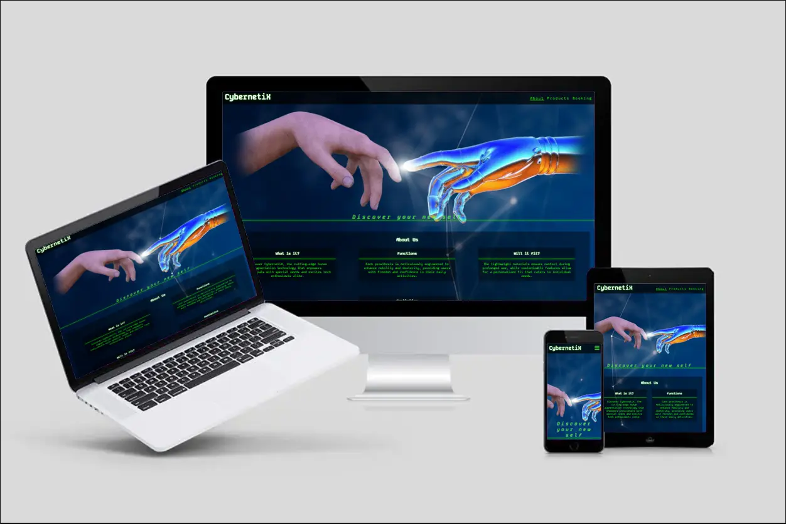

# CybernetiX

Cybernetix is a fictional website of our possible future offering implants and prosthesis products and services. Targeted on customers that want to upgrade their bio-bodies or replace their lost/worn body parts. Website is useful for people to find out information about Cybernetix products and book an appointment with us. The theme used is minimalistic and pleased to the eye as website has a medical purpose.

The site is responsive for all screen sizes.

 

## Features
* Navigation Bar
    -  Featured at the top of all three pages, the navigation links are situated to the right. 
    -  On larger screens they show the text; About, Products and Booking. On smaller screens, such as mobiles, the navigation links are situated in the burger-icon that expands when you click it.

* The Header
    -  At the top left in the header section, there is a company logo name, that will take the user to the home page when clicked.   
    -   The Company logo sets the font theme of futuristic coding style and a main color theme: green, white and black with some transparency.

* The Home page
    -   This is the landing page with it's vibrant art connecting human and robotic hands, together with a slogan text, inviting to embrace new possibilities. Picture is resembling the art of famous artist Michelangelo - the moment of divine creation.

* The About Us section
    -   The section below contains four paragraphs which explains user what is CybernetiX company offering and how user can benefit from their products.
    - At the bottom of the page, after user is introduced to CybernetiX, there is a button linked to products the page.

* The Footer
    -   The footer section includes relevant links to Facebook, Instagram and Twitter, following by copyright text.
    -   The links will open in a new tab and will introduce users to our happy customer stories shared on social networks.

* The Products page
    -   The products page gives the user a short preview on what kind of products company offers.
    -   There is a short paragraph of what page is offering and a text with anchor link leading to the booking page.

* The Booking page
    -   Booking form with minimalistic design that is easy to understand.
    -   Form allows user to fill in personal details that are necessary for appointment with Cyber-Doctors.
    -   Checkboxes allow to choose what kind of augmentation user wants to install.
    -   At the bottom of the form there are Submit and Reset buttons, designed with different styles to show that buttons have different purpose.
    

### Features left to implement
-   I would like to add a bigger range of products for each category mentioned in products page.
-   Reviews page, showing customer experiences with ratings and pictures
-   List and adresses of Cyber Clinics and names of certified Cyber Doctors.

## Testing
-   Accessibility
    -   I ran the pages through Lighthouse and confirmed that the colors and fonts are easy to read and that the site is accessible.
    -   Had a slow loading score in Brave browser - fixed it by disabling my extensions.
    -   Label elements in booking form were not assigned to input elements. Fixed by adding id names to input elements.
    -   Encountered error **"Error with Permissions-Policy header: Origin trial controlled feature not enabled: 'interest-cohort'."**
    Found the solution on https://github.com/orgs/community/discussions/52356 by adding meta tag " <meta http-equiv="Permissions-Policy" content="interest-cohort=()">"
    -   As a result, website performance score now is 99%
    
 
-   Tested and confirmed that the page works in different browsers: Brave(Chrome), Microsoft Edge, Mozilla.
-   Tested and confirmed that all internal links are working and redirecting the user between the pages.
-   Tested that all external links, to social media sites, are working and opening in a separate tab.
-   Tested and confirmed that the booking form works, all fields are required, (except checkbox, as it requires javascript which I am not familiar to yet).
-   Tested that the email field only accepts email address
-   Tested Submit button that brings to CodeInstitute page and Reset button clears the form

-   HTML
    -   No errors found when running the code through the [W3C HTML Validator](https://validator.w3.org/)

-   CSS
    -   No errors found when running the code through the [W3C CSS Validator](https://jigsaw.w3.org/css-validator/) 
    

## Bugs
-   There was a bug causing error on the css file when the Google fonts where imported with the @import link. 
I reached out to Tutor support that helped me and advised to use the link to add in the html file instead which solved the issue. Though they could not really tell why that was happening.
### Unfixed bugs
-   No unfixed bugs

## Deployment

### Version Control
-   The site was created using Gitpod editor and pushed to Github to the remote repository 'optimal_health'.
-   Git commands were used throughout the development to push the code to the remote repository. The following git commands were used:
    -   git add . - to add the files to the staging area before being committed.
    -   git commit -m "commit message" - to commit changes to the local repository queue that are ready for the final step.
    -   git push - to push all committed code to the remote repository on Github.

### Deployment to Github pages
-   The site was deployed to Github pages as follows:
    -   In the Github repository, I navigated to Settings tab
    -   From the source section drop-down menu, I selected the Master branch and Save
    -   Once the Master branch was selected, the page provided the link to the website
-   The live link: [Optimal Health](https://sophietiger.github.io/optimal_health/)

### Cloning of the Repository Code locally
-   Go to the Github repository that you want to clone
-   Click on the Code button located above all the project files
-   Click on HTTPS and copy the repository link
-   Open the IDE of your choice and and paste the copied git url into the IDE terminal
-   The project is now created as a local clone

## Wireframes
-   The site was developed with the Mobile-first method. The wireframes were therefore drawn with that thought in mind, and created with [Balsamiq](https://balsamiq.cloud/snx9v5f/pmhksri/rB1D0). First picture: Home page, Second picture: Services page, Third picture: Contact page.

  

## Credits
-   A special thanks to my Mentor for the support and answering all my Questions!
### Content
-   The icons in the footer and in the headings were taken from [Font Awesome](https://fontawesome.com/)   
The social media links to Facebook and Instagram are the real ones this company is using.
-   The Favicon in the Title of the page was taken from [Favicon](https://favicon.io/emoji-favicons/)
-   I took inspiration from the Love Running project to create the header, footer and contact page.
### Media
-   The images in the hero section, on the servives page and the contact page was taken from [Pexels](https://www.pexels.com/)
-   The profile picture on the Home page is from my private gallery.
-   The online coaching image on the services page, with pictures of an app, was with permission taken from [Nutrition Data](https://nutritiondata.se/)

